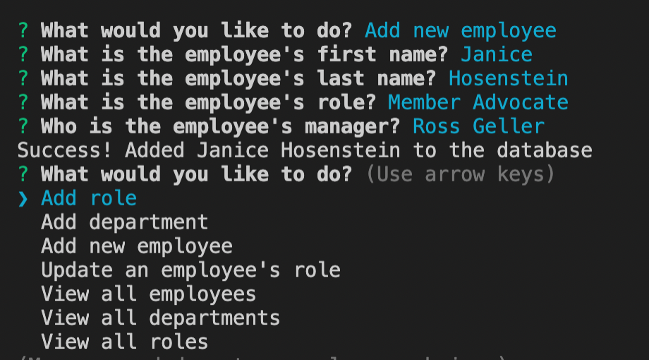
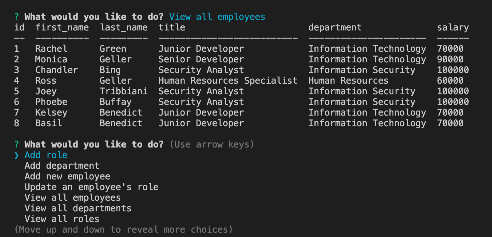

# Employee-Tracker
## Table of Contents 
1. [Description](#description)
2. [Installation](#installation)
3. [Usage](#usage)
4. [Built With](#builtwith)
5. [License](#license)

## Description
This is a tool that can be used to track employees in a database, along with their corresponding department and role. You can add a role, add a department, add a new employee, update an employee's role, view all employees, view all departments, and view all roles. 

[Check out my demo walkthrough](https://drive.google.com/file/d/1bRO97XY3YlWBL10izg-NOBP_H5LLYFO8/view?usp=sharing)

## Installation
Make sure you have node installed, along with the packages listed in package.json

## Usage
The usage of this application is to insert, update, and view employees in a database. 
## Built With
Node, inquirer, mysql, and express
## License

Copyright 2021 KelseyBenedict

Licensed under the Apache License, Version 2.0 (the "License"); you may not use this file except in compliance with the License. You may obtain a copy of the License at

http://www.apache.org/licenses/LICENSE-2.0

Unless required by applicable law or agreed to in writing, software distributed under the License is distributed on an "AS IS" BASIS, WITHOUT WARRANTIES OR CONDITIONS OF ANY KIND, either express or implied. See the License for the specific language governing permissions and limitations under the License.
